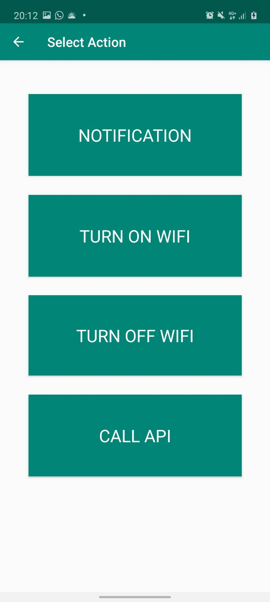

# IF3210-2020-59-IFTTW

## Deskripsi aplikasi
Fitur utama dari IFTTW adalah kemampuan penggunanya untuk membuat berbagai rutin. Suatu rutin terdiri dari tepat satu kondisi dan satu aksi. Jika suatu kondisi tertentu dipenuhi (misalnya, sekarang pukul 11.00), aksi yang terhubung dalam rutin  tersebut akan dijalankan (misalnya, pengguna diberi notifikasi). Kondisi dan aksi adalah sebuah  modul  yang berbeda dan terpisah satu sama lain, sehingga suatu kondisi bisa digunakan dalam banyak rutin (terhubung dengan aksi yang berbeda). Suatu modul bisa digunakan dalam banyak rutin.

Melalui aplikasi ini pengguna dapat membuat rutin baru. Satu rutin terdiri dari satu  modul kondisi dan satu modul aksi. Aplikasi juga dapat menjalankan rutin yang telah terdaftar dan aktif (menjalankan aksi jika kondisi yang sesuai terpenuhi), walaupun aplikasi IFTTW sedang tidak dibuka. Pengguna dapat menampilkan daftar rutin yang telah dibuat yang ditampilkan terpisah antara rutin yang aktif dan yang tidak aktif. Pengguna dapat mengelola rutin yang dimilikinya dengan cara mengaktifkan / menonaktifkan rutin, dan juga pengguna dapat menghapus rutin yang pernah dibuat.

Saat ini aplikasi ini memiliki beberapa modul yaitu :
1. Modul Kondisi Timer
Aktif jika waktu yang diinginkan tiba. Waktu yang diinginkan bisa berupa hal-hal berikut ini :
    * Suatu waktu tertentu (misal, 24 Februari 2020, 15:49)
    * Setiap hari pada waktu tertentu (misal, 16:10)
    * Setiap minggu pada hari dan waktu tertentu (misal, setiap Kamis pada 12:15
2. Modul Kondisi yang menggunakan sensor Proximity
3. Modul Aksi Notify Me
	* Mengirimkan sebuah notifikasi ke pengguna. Notifikasi yang didukung cukup berbasis text saja. Pengguna bisa melakukan kustomisasi terhadap title dan text detail dari notifikasi yang akan dikirimkan.
4. Modul Aksi yang mengakses API eksternal
	* API : [https://www.boredapi.com/documentation](https://www.boredapi.com/documentation)
5. Modul Aksi mengaktifkan / mematikan WiFi 

## Cara Kerja
Aplikasi menampilkan daftar rutin yang telah dibuat pada dua buah fragment yang mana rutin terpisah antara rutin yang aktif dan rutin yang sudah tidak aktif. Ketika pengguna ingin membuat sebuah rutin baru maka, pengguna diminta mengisikan keterangan mengenai kondisi dan aksi yang ingin dibuat. Ketika pengguna mengklik tombol create maka aplikasi akan melakukan pengecekan.

Jika kondisi yang diinginkan berkaitan dengan timer maka akan dikirimkan PendingIntent kepada Timer Broadcast Receiver, dari sana data mengenai rutin yang akan dibuat di parsing dan dilakukan pengiriman intent kepada Broadcast Receiver kedua. Pengiriman intent (data pada Intent) bergantung pada jenis aksi yang ingin dilakukan. Ketika Broadcast Receiver (khusus menangani pembuatan aksi) kedua menerima Intent, maka dilakukan pengecekan pada jenis aksi dan akan menjalankan metod yang sesuai. Setelah itu data rutin dimasukan ke database.

Jika kondisi yang diinginkan berkaitan dengan sensor maka akan dijalankan foreground service, foreground service akan berkomunikasi dengan Broadcast Receiver yag bertanggung jawab dalam pemanggilan aksi. Ketika Broadcast Receiver tersebut menerima Intent maka proses selanjutnya sama seperti Timer.

* Modul Kondisi Timer dibuat dengan memanfaatkan AlarmManager yang dapat mengirimkan PendingIntent sesuai dengan waktu yang di inginkan. 
* Modul Kondisi yang menggunakan sensor dibuat dengan memanfaatkan Foreground Service
* Modul Aksi Notify Me dibuat dengan memanfaatkan Notification Manager dan Broadcast Receiver. Selain itu dilakukan pembuatan notification channel (untuk versi Android > 8.0)
* Modul Aksi yang mengakses API eksternal dibuat dengan Volley
* Modul Aksi mengaktifkan / mematikan WiFi dibuat dengan Wifi Manager. Namun modul ini tidak lagi dapat digunakan pada versi Android 10 dikarenakan Android 10 melarang aplikasi dapat secara langsung mengaktifkan / mematikan WiFi.
    
## Library yang Digunakan 
Aplikasi menggunakan library Volley. Adapun kegunaan library Volley adalah untuk mempermudah dan mempercepat networking. Hal ini juga memudahkan pengembang android untuk request ke suatu API. Kami menggunakan Request Queue dari Volley untuk request ke boredapi.com/api/activity.
##  Screenshot Aplikasi

